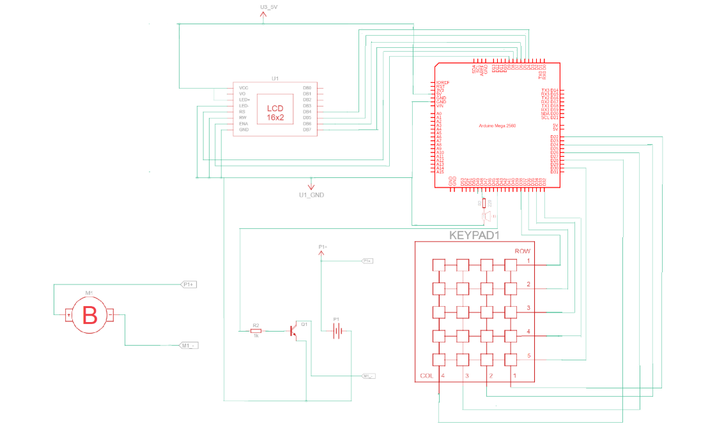

# Bomba de Infusão :droplet:
Bomba de infusão desenvolvida pelo DEBM UPFE... prof... alunos...

## Funcionalidades :gear:
Adicionar todas as funções implementas na bomba de infusão.

## Diagrama Elétrico :zap:

## Lista de Equipamentos :hammer_and_wrench:
- Arduíno Mega 2560;
- TIP 120;
- Buzzer passivo;
- Display 16x2 LCD Keypad Shield com Teclado para Arduino;
- Teclado Matricial De Membrana 4x5 de 20 Teclas;
- Equipo universal;
- Resistores.
